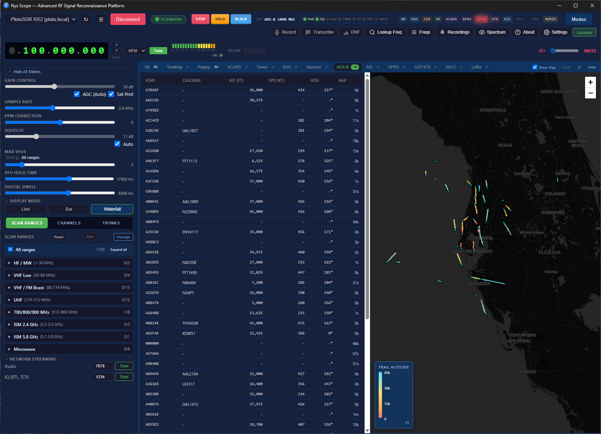

# Nyx Scope — User Manual

*Version 1.25.0*

This manual walks through the common things you'll actually do with Nyx Scope: scanning a frequency range, following a trunked radio system, tracking aircraft, decoding pagers, listening to HD Radio, and so on. It assumes you've already installed the app and have an SDR plugged in.

If you're brand-new, start with **Getting Started** below. If you have a specific task in mind, jump straight to its section.

- [Getting Started](#getting-started)
- [A quick tour of the interface](#a-quick-tour-of-the-interface)
- [Scanning a frequency range](#scanning-a-frequency-range)
- [Working with channel banks](#working-with-channel-banks)
- [Locking on one frequency](#locking-on-one-frequency)
- [Quick Modes](#quick-modes)
- [Trunked radio (P25, EDACS, NXDN)](#trunked-radio-p25-edacs-nxdn)
- [Trunk Discovery](#trunk-discovery)
- [Aircraft and marine tracking](#aircraft-and-marine-tracking)
- [ISM sensors and rtl_433](#ism-sensors-and-rtl_433)
- [Paging (FLEX / POCSAG)](#paging-flex--pocsag)
- [HD Radio (NRSC-5)](#hd-radio-nrsc-5)
- [Tones, EAS, APRS, Morse, LoRa, radiosonde](#tones-eas-aprs-morse-lora-radiosonde)
- [Recording and transcription](#recording-and-transcription)
- [Streaming and the HTTP API](#streaming-and-the-http-api)
- [Settings worth knowing about](#settings-worth-knowing-about)
- [Licensing](#licensing)
- [Troubleshooting](#troubleshooting)

---

## Getting Started

**Install.** Download `NyxScope-1.25.0-x64-setup.exe`, double-click, and follow the installer. Every required decoder sidecar (rtl_433, multimon-ng, acarsdec, direwolf, nrsc5, dump978, dumpvdl2, rs41mod, dsd-neo) ships bundled — you don't install them separately.

**Drivers.** Before you can talk to an RTL-SDR dongle, you must swap its kernel driver to WinUSB using [Zadig](https://zadig.akeo.ie/). HackRF, Airspy, bladeRF, SDRplay, Fobos, and PlutoSDR work through SoapySDR — install the vendor's driver/firmware first, then the SoapySDR module for your device.

**First launch.** When you start Nyx Scope, you'll see the main spectrum view with no SDR connected yet.

1. Click the **Device** button (top bar). A dialog lists every SDR Nyx Scope can find: USB-attached dongles, network rtl_tcp services it discovered via mDNS, and any PlutoSDRs at known IP addresses.
2. Pick your device. Nyx Scope will negotiate a supported sample rate, set a reasonable starting gain, and start streaming IQ.
3. Click **Start Scan** (left panel). The default scan range is the FM broadcast band — you should immediately see strong stations, hear audio on the locked one, and see waterfall activity.

If something doesn't work at this stage, jump to [Troubleshooting](#troubleshooting).

---

## A quick tour of the interface

The window has three main regions:

- **Left panel** — scan ranges, channel banks, Quick Modes, gain/squelch, and device controls.
- **Center** — spectrum display on top, waterfall below, and the VFO list (one card per active demodulator) underneath.
- **Right panel** — the dock: a tabbed area where decoded messages, tracking maps, data logs, the trunking workspace, HD Radio status, and the Trunk Discovery results all live.

The **top bar** holds the master volume + mute, the active device chip, an annunciator that shows the current scan source and sweep progress, decode activity LEDs for each protocol family, and the master "Popup alerts" toggle.

> 💡 Most things you'll want to act on (a peak in the spectrum, a sensor row in the data log, a trunked talkgroup) have a **right-click menu** with the common actions — tune-to, lookup, save as channel, ignore, etc.

---

## Scanning a frequency range

A *scan range* is a band Nyx Scope sweeps repeatedly looking for signals. The left panel lists every configured range — Nyx Scope ships with dozens (FM broadcast, ham bands, public safety, ISM, aviation, etc.).

**To scan a range:**

1. Open the left panel's **Range** tab.
2. Click the checkbox next to one or more ranges you want active. A red checkbox means "skip this range." Right-click a range for context options: edit, delete, scan only this one, or **Discover Trunked Systems** (starts CC discovery on this band — see [Trunk Discovery](#trunk-discovery)).
3. Click **Start Scan** at the top of the panel. You'll see the spectrum view update as the scanner hops between ranges.

**Per-range overrides.** Right-click → **Edit Range** lets you set per-range scanner behavior: squelch, auto-squelch mode, hold time, and digital dwell. These override the global Settings defaults *only* for this range. Useful when, say, your ham 2m range needs different squelch than the milair band.

**Skip / Block.** Right-click any signal or VFO card and choose **Skip** to temporarily exclude it from this scan, or **Block** to permanently blacklist it (survives app restart; remove later via the **Blocked** dock tab).

**Sweep progress** is shown in the annunciator under the top bar. The chip cycles through your enabled ranges as it sweeps.

---

## Working with channel banks

A *channel bank* is a list of specific frequencies (with optional names, tones, and modes) — useful when you know exactly what you want to monitor and don't want to sweep a continuous range.

**Adding channels:**

- **Right-click → Save Frequency** from any tuned VFO, spectrum peak, or data-log row.
- **Channel Editor** (left panel → **Channels** tab → ✏️) — manual entry with a hierarchical tree view, favorites, bulk edit, and right-click context menus.
- **Import** — CHIRP CSV, RadioReference SOAP (state/county browser, multi-site selection), or the i-c.biz FCC bulk import dialog with a "Near Me" button.

**Channel scan mode:**

1. Left panel → **Channels** tab.
2. Check the banks you want to scan and click **Start Scan**. Nyx Scope hops to each channel in turn, dwelling for the configured hold time when signal is present.
3. Priority channels are sampled more often. Set priority via Channel Editor.

---

## Locking on one frequency

Sometimes you want to listen to one signal continuously — a known repeater, a broadcast station, a specific data stream — without the scanner moving on.

**To lock:**

- **Double-click** a peak in the spectrum or waterfall.
- **Right-click → Tune to frequency** from any context menu.
- Type a frequency into the top-bar **Lock** field and press Enter.

When locked, the scanner stops sweeping and a single VFO sits on the locked frequency. Click **Unlock** in the top bar (or in the VFO card menu) to return to scanning.

**Locked-mode features:**

- A **Manual Digital Mode** dropdown appears on the VFO card. Pick P25, DMR, NXDN48, NXDN96, D-STAR, or YSF, or use **Auto-identify** to let Nyx Scope cycle through DSD modes, count sync frames, and select the best match.
- HD Radio auto-engages on FM broadcast locks 87.9–108.1 MHz if `Settings → HD Radio → Auto on FM Lock` is on (see [HD Radio](#hd-radio-nrsc-5)).
- The mini-waterfall in the VFO card shows the locked signal's spectrum slice. Right-click it to save the image.

---

## Quick Modes

Quick Modes are the fast-launch surface for the 11 most common workflows. The top bar has favorites pinned for fast access; the full menu is in the LeftPanel → **Quick Modes** tab.

| Preset | Frequency | What it does |
| --- | --- | --- |
| ADS-B 1090 | 1090 MHz | Dedicated aircraft tracking with tracking map |
| AIS 162 | 161.975 / 162.025 MHz | Marine traffic (native dual-channel GMSK) |
| ACARS 130 | 130 MHz | Aviation messaging |
| VDL2 137 | 136.975 MHz | VHF Data Link Mode 2 |
| UAT 978 | 978 MHz | UAT ADS-B for general aviation |
| APRS 144.390 | 144.390 MHz | AFSK1200 decode |
| Pagers 929-932 | 929–932 MHz | FLEX/POCSAG decode |
| 433 Sensors | 433 MHz ISM | rtl_433 sensors |
| 915 Sensors | 902–928 MHz ISM | rtl_433 + smart meters |
| Radiosonde 400-406 | 400–406 MHz | Weather balloon telemetry |
| LoRa US915 / EU868 / EU433 | (multiple) | Native CSS decoder, SF7-12 parallel |

Click a preset → Nyx Scope sets the device sample rate, tunes to the right frequency, enables the relevant decoder, and opens the corresponding data-log tab. Click **Stop** in the top bar to exit Quick Mode.

---

## Trunked radio (P25, EDACS, NXDN)

A trunked radio system uses a *control channel* (CC) to assign each call a temporary voice frequency. Nyx Scope follows that handoff automatically once you tell it which system to track.

### Setting up a system

1. Open the **Trunk Editor** modal (left panel → **Trunks** → ✏️, or top-bar quick mode).
2. Click **+ New System** and pick the type: P25 Phase 1, P25 Phase 1+2, EDACS Standard, EDACS-EA, NXDN-48, NXDN-96.
3. Enter the control channel frequencies. You can:
   - Type them manually,
   - Import from RadioReference (Settings → API credentials required),
   - Or use [Trunk Discovery](#trunk-discovery) to find them automatically.
4. Optionally add talkgroup names, NAC/SYS-ID, LCN tables (for NXDN), and Zones for grouping.
5. **Save**.

### Following the system

1. Left panel → **Trunks** tab → click the system you just created.
2. Click **Start Trunking** (top of panel, or from the **Trunkandpaging** dock).
3. Nyx Scope locks onto the first responsive CC, decodes TSBKs in real time, and tunes a voice VFO whenever a talkgroup grant comes through.

The trunking workspace shows:

- **Active calls** — currently-running voice grants with talkgroup, source radio ID, and start time.
- **Recent calls** — rolling history with click-to-replay (when recording is on).
- **Channel map / LCN map** — the system's frequency plan as Nyx Scope has learned it.
- **Zones** — collapsible groups of talkgroups.

**Lock-TG and Monitor:** right-click a talkgroup → **Lock to TG** to stay on it across grants, or → **Monitor** to add it to a watchlist.

### P25 Phase 2 voice

Phase-2 voice channels use TDMA and a different modulation than Phase-1. Nyx Scope detects `IDEN_UP_TDMA` and switches to the H-DQPSK decoder automatically. You'll see an orange **P2** badge on the voice card when this happens.

### EDACS specifics

- **EA mode** (Extended Addressing) is auto-detected via the site-ID pattern in CC frames. Florida SLERS is an example.
- **ESK** (scrambled CC) is auto-detected and decoded — no manual toggle.

### NXDN specifics

- **NXDN-48** = 4800 baud / 6.25 kHz channels (common Type-1 systems).
- **NXDN-96** = 9600 baud / 12.5 kHz channels.
- Channel maps are computed from the system's **base frequency** and **channel spacing** after the first `SITE_INFO` message decodes. You don't need to enter LCN frequencies manually — they're learned.

---

## Trunk Discovery

If you suspect a P25 system is on the air but don't know its CC frequencies, let Nyx Scope find them.

**Two ways to run it:**

- **Right-click a scan range → Discover Trunked Systems.** This starts CC discovery on that band's frequencies and opens the discovery pop-out automatically.
- **Overlay mode.** Already scanning? Top bar → **Discover (Overlay)**. The same per-VFO P25/EDACS/NXDN decoders run as the scanner sweeps, so candidates accumulate without interrupting your current activity.

**The discovery window** shows every candidate frequency it's seeing:

| Status | What it means |
| --- | --- |
| **✓ Confirmed** | ≥ 8 valid TSBK or P25 frames within 5 seconds at this frequency, with a real NAC and either a system ID or unique NAC dedup key. |
| **· Candidate** | Frames being received but the threshold hasn't been crossed yet. May yet confirm, or may be noise that fades. |
| **⊙ In Config** | This frequency is already a control channel in one of your saved systems. |

The header shows three counts: confirmed · candidates · in config. The filter row lets you hide already-configured rows or show confirmed only. Click a column header to sort.

**Adding discovered CCs to a system:**

- Check one or more confirmed rows → click **+ Add to config** in the bulk-select bar.
- Or click the **+** icon on any confirmed row for one-click add.

**Progress.** The bar shows elapsed-time / budget (default 5 minutes — adjustable via `Settings → Trunking → CC discovery budget`). When discovery is running on the dedicated sweep mode (range right-click), the bar tracks real FFT + probe progress.

**Cold start.** Reopening the window after a previous session shows the persistent results — they survive between scans.

---

## Aircraft and marine tracking

Several built-in modes produce live position data that renders on an inline tracking map next to the data table.

### ADS-B (1090 MHz)

- **Quick Modes → ADS-B 1090** sets up everything: sample rate, frequency, decoder, and opens the **Aircraft** dock tab.
- The map shows each aircraft with ICAO hex code, callsign, altitude, speed, and heading. Click a row to focus the map.
- Right-click an aircraft → **Lookup** for registry, type, owner, and route history (uses the self-hosted i-c.biz OpenSky mirror; works offline if you've cached results).
- Full-screen toggle: click the ↗ in the corner of the map.

### UAT (978 MHz) — general aviation

Same setup, different Quick Mode: **UAT 978 (dump978)**. UAT-equipped aircraft (mostly piston general aviation in the US) decode through the `dump978` subprocess. Positions appear on the same Aircraft map; UAT traffic is tagged so you can filter.

### AIS — marine traffic

- **Quick Modes → AIS 162** runs the native dual-channel GMSK decoder on AIS-A (161.975) and AIS-B (162.025) in parallel.
- Vessels appear on the **Vessels** dock tab with MMSI, name (when transmitted), course over ground, and speed over ground.
- Class-A and Class-B reports are decoded; aids-to-navigation, base stations, and SAR aircraft each get their own marker style.

### ACARS

VHF ACARS at 129.125 / 130.425 / 130.450 MHz. The native MSK decoder + `acarsdec` sidecar produces structured frames: registration, flight number, label (free text, weather, position report, etc.), and content. Map view shows the aircraft when position is reported in the message.

### VDL2

VHF Data Link Mode 2 around 136.975 MHz, decoded via `dumpvdl2`. Frames appear in the **Messages** tab under Decode. VDL2 is bursty — expect long quiet periods between message clusters.

---

## ISM sensors and rtl_433

Smart meters, weather stations, tire pressure sensors, and dozens of other ISM-band devices broadcast their telemetry openly. Nyx Scope decodes everything `rtl_433` supports.

**To monitor:**

1. **Quick Modes → 433 Sensors** (433 MHz ISM band) or **915 Sensors** (902–928 MHz, includes US smart meters).
2. The **Sensors** dock tab populates as messages decode, grouped by device ID + protocol.
3. Each sensor card shows current readings in both metric and imperial units (temperature, humidity, pressure, battery, rain, etc.).

### Smart meters

If you're on the 915 MHz preset, ERT-SCM / IDM / NETIDM smart-meter messages decode for every utility meter in range — water, gas, electric. Each meter gets a card showing consumption and the running ID.

### Car remotes

433 MHz car remote keyfobs decode as raw OOK messages. The **433 Car Remotes** dock tab lists them with rolling-code information when the protocol supports it.

### Sensor history

Every decoded message goes into the sensor database. Open the data-log tab and switch to **Sensors** for the full history with filters by device, protocol, and time range.

---

## Paging (FLEX / POCSAG)

Pagers are still in widespread use for hospitals, fire departments, and industrial messaging. Nyx Scope's native decoder handles both FLEX (1600/3200/6400 bps) and POCSAG (512/1200/2400 bps) without a subprocess.

**Two ways to monitor:**

- **Quick Modes → Pagers 929-932** for the US commercial pager band.
- **Pager Monitor mode** (left panel → **Pager Monitor** when on a paging-suitable range) for wideband multi-channel paging. This dedicates up to 16 VFOs to channel discovery + decoding, snapping signals to the 12.5 kHz grid. Open the Pager Monitor panel for live diagnostics: active VFOs, channels discovered, total messages, preemptions.

**Capcode filtering.** Right-click a pager message → **Filter by capcode** to focus on one address. Save filters in Settings → Protection.

**Tone detection** (CTCSS/DCS) runs in parallel on every VFO when the master TONE toggle is on — useful for matching paging signals to their analog companions.

---

## HD Radio (NRSC-5)

When you lock on a US FM broadcast station (87.9–108.1 MHz) that transmits HD Radio, Nyx Scope decodes the digital subchannel automatically.

**To activate:**

- Make sure `Settings → HD Radio → Enabled` and `Auto on FM Lock` are both on.
- Lock to an HD-capable FM station (double-click the spectrum peak).
- The **HD Radio** dock tab populates with sync status, BER/MER, station name, slogan, and live now-playing metadata.

**Program switching.** Stations often broadcast HD2/HD3/HD4 subchannels alongside their main HD1 program. Click the program selector buttons in the HD Radio panel to switch — Nyx Scope re-routes audio without retuning.

**Album art.** The big tile in the panel (and a smaller version on the VFO card) shows the current track's artwork as it streams via the LOT/XHDR data path. Station logos appear next to it when broadcast.

**Note about RDS.** If a station transmits RDS on the analog subcarrier (separate from HD Radio), the VFO card also shows the RDS station name, PI code, PTY, and RadioText below the HD panel. RDS sync quality and characters are filtered against bit-error noise — see the RDS bug fixes in v1.25.0 release notes.

---

## Tones, EAS, APRS, Morse, LoRa, radiosonde

A grab-bag of less-common but fully-supported modes:

- **CTCSS / DCS tones.** Master toggle is the pink **TONE** chip in the top bar's decoder row. Detection runs per-VFO. Sightings persist to the **Tones** tab.
- **DTMF / ZVEI / EEA / EIA / CCIR** signaling tones decode alongside CTCSS in the **Tones** tab.
- **EAS.** Emergency Alert System SAME headers (weather warnings, AMBER, civil) decode whenever you're on an EAS-active frequency (NWS, broadcast). The **EAS** dock tab lists alerts with origin, event code, county FIPS, and expiration.
- **APRS.** AFSK1200 at 144.390 MHz (Quick Mode) or any 1200-baud channel. Decoded packets show on the tracking map alongside ADS-B and AIS, and in the **APRS** data-log tab.
- **Morse / CW.** Lock to a CW signal and the Morse decoder reads the dits/dahs into text on the VFO card.
- **LoRa.** Native CSS decoder with SF7-12 in parallel; LoRaWAN MAC parsing (DevAddr, FCnt, FPort, MType) for all 9 regions. Quick Modes for US915, EU868, EU433 — Settings → LoRa → Region for the others.
- **Radiosonde.** Weather-balloon telemetry at 400–406 MHz: RS41, RS92, DFM, M10/M20 supported via `rs41mod` and its siblings.

---

## Recording and transcription

Every active VFO can record both audio (WAV) and IQ (CS16 or CF32) on demand.

**Per-VFO recording controls:**

- **🔴 button** on the VFO card — toggle audio recording.
- **🎚️ button** — toggle IQ recording.
- VAD/VOX trigger and pre/post-record buffers are configurable in `Settings → Recording`.

**Recordings tab** lists every clip. For each you can:

- **▶ Play** in-place.
- **+ Add note** for later reference.
- **⏭ SKIP** (mark for later cleanup).
- **🗑 Delete.**
- **📝 Transcribe** (manual trigger if auto-transcribe is off).

### Transcription

Three engines, configurable per VFO and globally:

| Engine | Where it runs | Cost |
| --- | --- | --- |
| **Whisper (local)** | On your machine, no network | Free (CPU/GPU) |
| **OpenAI** | OpenAI API | Pay-per-minute, API key required |
| **AssemblyAI** | AssemblyAI API | Pay-per-minute, API key required |

**Auto-transcribe** runs on each recording as it completes. Enable in `Settings → Transcription`, then arm with **Transcribe All** in the top bar to enable it for every active VFO. The transcript travels with the WAV file as a sidecar — share the recording, the text comes with it.

---

## Streaming and the HTTP API

Nyx Scope exposes a local HTTP API on port 8765 that runs whenever the app is open. You can use it for automation, scripting, or as a control surface from another machine on your LAN.

**Useful endpoints:**

- `GET /api/spectrum` — current FFT snapshot.
- `GET /api/scanner_status` — running scan state.
- `GET /api/vfo_states` — per-VFO frequency, mode, signal strength.
- `GET /api/decoded_messages` — recent decodes across protocols.
- `GET /api/trunking/discovery/snapshot` — current Trunk Discovery state including every candidate.
- `POST /api/scan/start` / `/stop` — control the scanner.
- `POST /api/lock?frequency_hz=...` — lock to a frequency.

**Audio/IQ streaming:**

- `GET /api/audio/stream` — Icecast-compatible MP3/OGG audio of the active VFO.
- `rtl_tcp` server on the device port — pipe raw IQ to GQRX, SDR# clients on the same LAN.

The full endpoint list is browsable at `http://127.0.0.1:8765/` (Nyx Scope serves a self-documenting index page).

---

## Settings worth knowing about

**`Settings → Scanner`**

- *Default squelch (dBFS)* — global floor; per-range overrides take priority.
- *Hold time (ms)* — how long to dwell on a signal after squelch closes before resuming.
- *Digital dwell (ms)* — extended dwell for digital modes that need more frames to sync.

**`Settings → Trunking`**

- *CC discovery budget* — default 300 s; the discovery window's progress bar uses this to compute %.
- *Voice hold (ms)* — how long after a TDU before returning to CC.
- *Default encrypted* — whether to attempt decode on encrypted talkgroups (mostly produces silence).

**`Settings → Recording`**

- *VAD threshold + pre/post buffers* — voice-activity-triggered recording.
- *Output format* — WAV (CD-quality or 8 kHz mono), with optional FLAC.

**`Settings → Transcription`**

- *Engine* + API keys.
- *Per-VFO opt-in* — uncheck VFOs you don't want transcribed.

**`Settings → Device`**

- *PPM correction*, *gain* (or AGC), *sample rate*, *PlutoSDR custom IP*.
- *Auto-reconnect* — Windows has this disabled by default for HackRF (known libusb stability issue). Click the Device button to reconnect manually.

**`Settings → HD Radio`**

- *Enabled* + *Auto on FM Lock*.
- *Program preference* (HD1 by default).

**`Settings → LoRa`**

- *Region* — channel plan and sync word for the 9 supported LoRaWAN regions.

---

## Licensing

Nyx Scope has three tiers:

| Tier | What you get | How to activate |
| --- | --- | --- |
| **Free** | Up to 1 VFO, basic decoders, no transcription quota | Default — no activation needed |
| **Trial** | Full features for 30 days, hardware-bound | `Settings → License → Request Trial` |
| **Licensed** | Permanent license, up to 32 VFOs, all decoders, support | Paste your key in `Settings → License` |

The window title shows your tier: **"Free Version, Non Commercial Use Only"** is appended to the title when you're on Free or your license has expired.

**License heartbeat.** Every 6 hours the app contacts `i-c.biz` to verify the key isn't revoked. The heartbeat carries only the key ID and a hashed hardware fingerprint — no audio, no decoded content, no scan data.

**Buy / renew:** [https://i-c.biz/buy/](https://i-c.biz/buy/) — see the Pricing section for the current comparison table.

---

## Troubleshooting

### "Device not found" / SDR doesn't appear in the list

- **RTL-SDR**: did you run Zadig and replace the driver with WinUSB? You can confirm in Device Manager — the device should appear under *Universal Serial Bus Devices* with "Bulk-In, Interface (Interface 0)", not under *Sound Controllers* or *USB Devices* with the original driver.
- **HackRF / Airspy / others**: install the vendor's USB driver first, then the SoapySDR module that matches it. HackRF in particular wants `libhackrf-0.dll` next to the SoapyHackRF DLL.
- **Network rtl_tcp**: try `ping` to the host; mDNS discovery only works on the same subnet.

### "HackRF stream reactivate after rate change failed"

Known Windows + libusb interaction. Click the **Device** button to reconnect — the app intentionally does not auto-recover this one because the libusb crash risk is higher than the inconvenience. Rapid sample-rate changes (above 10 Msps especially) are the usual trigger; pick one rate at the start of a session and leave it.

### Audio is silent on a strong signal

- Master mute off? Volume up?
- VFO card mute off? VFO volume up?
- Squelch too tight — `Settings → Scanner → Default squelch` and try a more negative value (e.g. -45 → -55 dBFS).
- Digital signal? Check the VFO badge: `Voice` / `Digital`. Digital voice (P25, DMR, NXDN) needs the dsd-neo path; verify in `Settings → Voice → dsd-neo path`.

### Trunk Discovery shows nothing

- Are you running discovery, or just scanning? See [Trunk Discovery](#trunk-discovery) — the overlay mode needs to be explicitly started (top bar → **Discover (Overlay)** while scanning, or right-click a range → **Discover Trunked Systems**).
- Watch the periodic `SCAN:` line in the debug log for `cc_overlay_feed=N/M` — if N is small relative to M, classifier is gating; if N matches M but `cc_cand` is 0, the band is genuinely quiet.

### "I see decode toasts but the discovery table is empty"

The popup toasts come from the general digital decoder pipeline, not the CC discovery tracker. They fire whenever any protocol decodes anything (voice, TSBK, etc.). The discovery tracker is separate — start an overlay or dedicated discovery sweep to feed it.

### HD Radio shows sync but no audio

- nrsc5 must be built with `faad2` for audio. The bundled `nrsc5.exe` in the installer is. If you've pointed `Settings → HD Radio → nrsc5 path` at a different build, verify it has `USE_FAAD2=ON`.
- Auto-program-switch may have moved off HD1 — check the program selector and click HD1 explicitly.

### Trial period ended unexpectedly

- The trial is 30 days from first install, hardware-bound. Reinstalling doesn't reset it.
- If you genuinely had less than 30 days, contact support via Discord or the i-c.biz contact form with your hardware fingerprint (`Settings → License → Copy Hardware ID`).

### Where are recordings saved?

`%APPDATA%\NyxScope\recordings\` by default. The path is configurable in `Settings → Recording → Output directory`. WAV files are named with the VFO frequency + UTC timestamp; sidecar `.txt` transcripts share the same stem.

### Where does Nyx Scope store its config?

`%APPDATA%\NyxScope\settings.json`. License cache in `%APPDATA%\NyxScope\license.json`. Both are plain text — back them up if you've put serious time into channel banks or trunked systems.

### How do I report a bug?

Discord, or open an issue at the public source mirror. If the bug involves a specific signal, please include:

- Your SDR model + driver version
- The frequency
- A short IQ recording (`Record → IQ` on the VFO card) — Nyx Scope can replay these later for reproduction

---

*This manual covers Nyx Scope v1.25.0. Features and behaviors may differ on older versions — check `Help → About` in-app for your exact build.*
