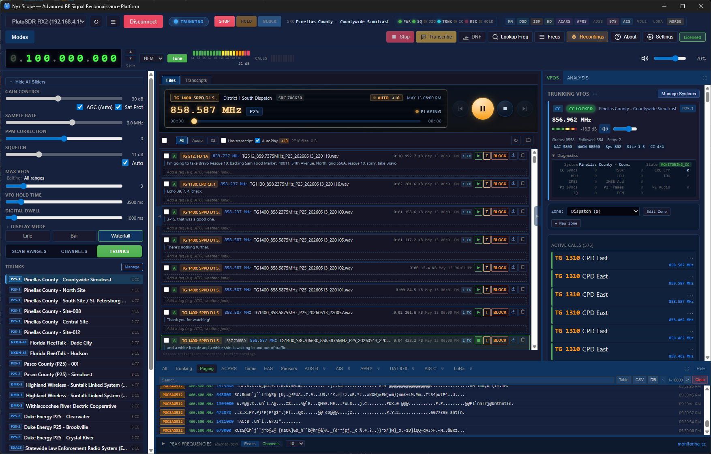
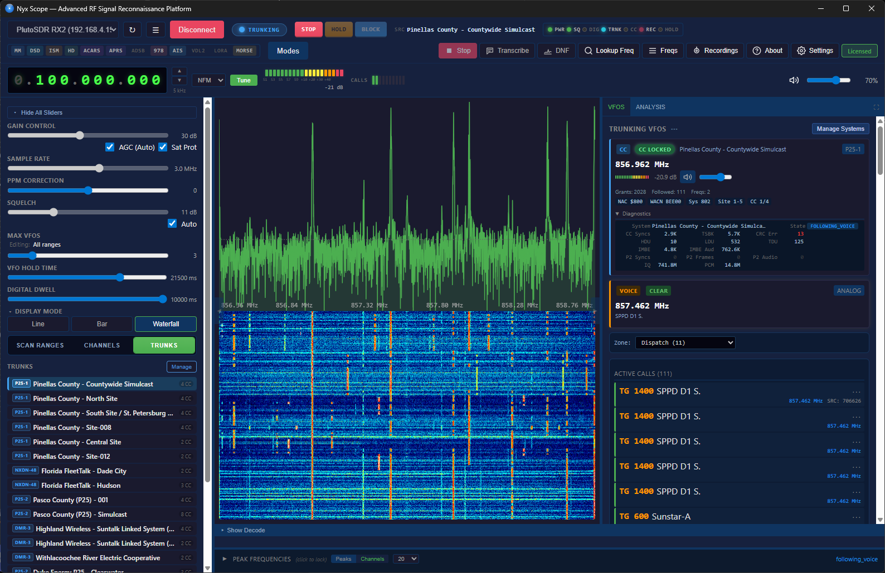
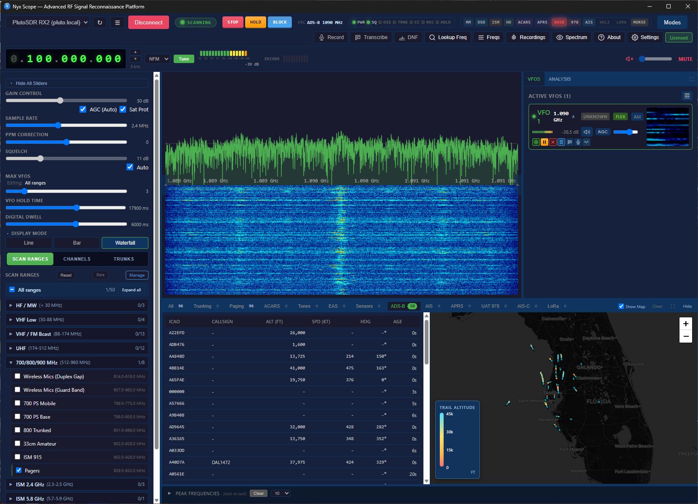
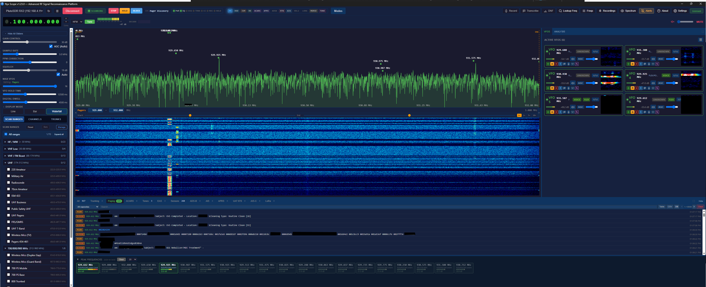
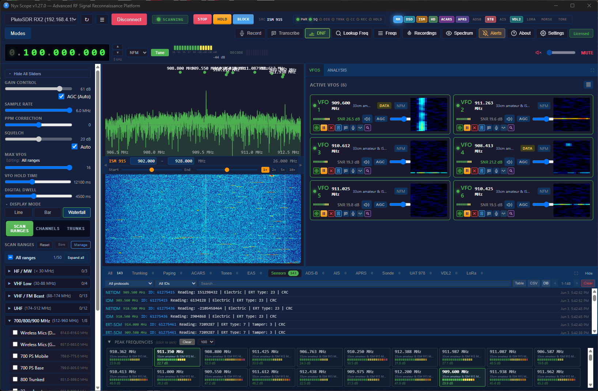
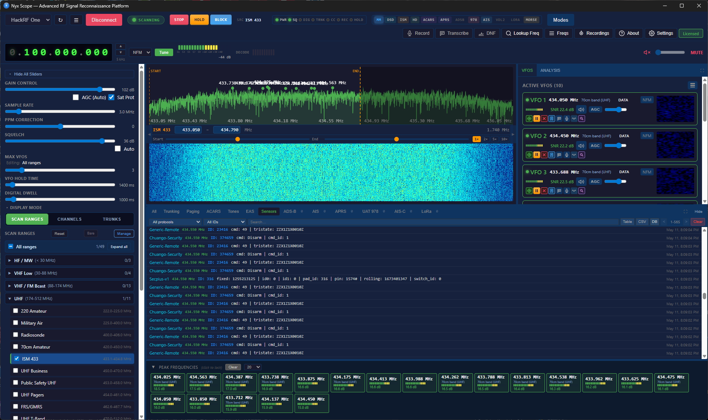
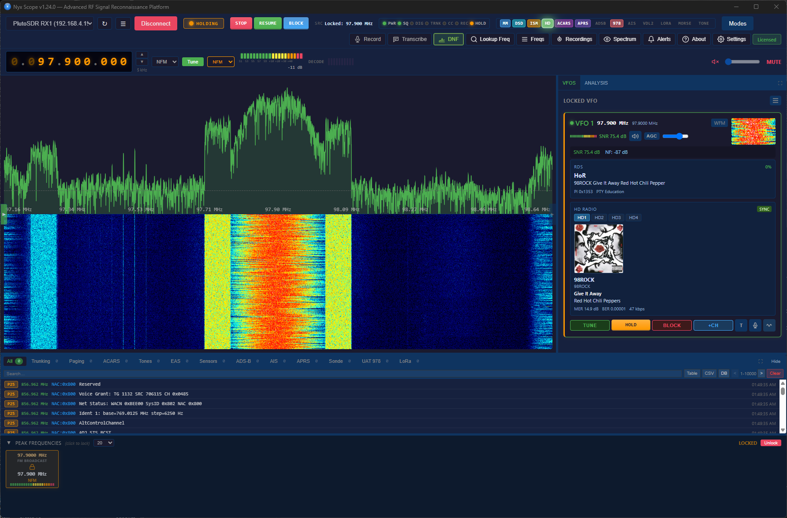
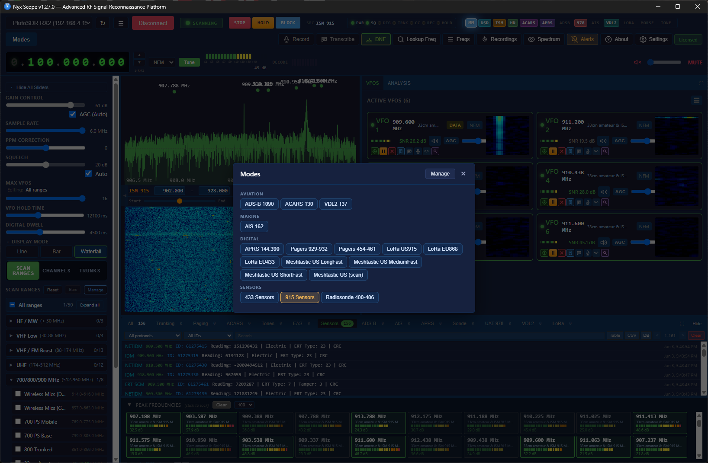

# NyxScope

**A multi-protocol SDR receiver for Windows. One UI, the best open-source decoders bundled in.**

NyxScope wires together a curated set of open-source SDR decoders — `multimon-ng`, `rtl_433`, `dsd-neo`, `nrsc5`, `direwolf`, `acarsdec`, `dump978`, `AIS-catcher`, `dumpvdl2`, `rs41mod`, `mbelib-neo` — behind a single Rust/Tauri application. You get spectrum and waterfall, up to 16 concurrent VFOs, trunked-radio following (P25 Phase 1 and 2, EDACS, NXDN), digital voice, aviation and marine tracking, paging, ISM sensors, HD Radio, and transcription, without compiling sidecars, managing `PATH`, or gluing pipelines together.

[**Download**](https://github.com/ICBizLabs/NyxScope/releases/latest) · [**Source mirrors**](https://i-c.biz/sources/) · [**Issues**](https://github.com/ICBizLabs/NyxScope/issues) · [**Docs**](https://icbizlabs.github.io/NyxScope/)

---

## Built on open source

NyxScope would not exist without the radio decoder community. Every digital decode you see comes from work done by these projects:

| Upstream | What it does | License |
| --- | --- | --- |
| [multimon-ng](https://github.com/EliasOenal/multimon-ng) | Paging, tones, EAS, AFSK, classic digital modes | GPL-2.0-or-later |
| [rtl_433](https://github.com/merbanan/rtl_433) | 200+ ISM-band sensors and utility meters | GPL-2.0-or-later |
| [dsd-neo](https://github.com/arancormonk/dsd-neo) | P25 / DMR / NXDN / ProVoice digital voice | GPL-3.0-or-later |
| [mbelib-neo](https://github.com/arancormonk/mbelib-neo) | IMBE / AMBE / AMBE+2 vocoder | GPL-2.0-or-later |
| [nrsc5](https://github.com/theori-io/nrsc5) | HD Radio (NRSC-5) | GPL-3.0 |
| [direwolf](https://github.com/wb2osz/direwolf) | APRS / AX.25 | GPL-2.0 |
| [acarsdec](https://github.com/TLeconte/acarsdec) | ACARS | LGPL-2.0 |
| [dumpvdl2](https://github.com/szpajder/dumpvdl2) | VHF Data Link Mode 2 | GPL-3.0 |
| [dump978](https://github.com/mutability/dump978) | UAT 978 MHz ADS-B | GPL-2.0 |
| [AIS-catcher](https://github.com/jvde-github/AIS-catcher) | AIS | GPL-3.0-or-later |
| [rs41mod (RS)](https://github.com/rs1729/RS) | Radiosonde telemetry | GPL-3.0 |

And the frameworks the app itself is built on: [Rust](https://www.rust-lang.org), [Tauri](https://tauri.app), [Svelte](https://svelte.dev) — all Apache-2.0 / MIT.

If a decode is wrong or a protocol is missing, the fix usually belongs **upstream**, with the project that owns the decoder. Bug reports against NyxScope's wrapper and UI are welcome here; protocol-layer bugs belong with the people who maintain that decoder. We do not maintain forks of bundled tools.

## Native decoders and DSP

Alongside the bundled FOSS stack, NyxScope ships its own native Rust decoders and DSP for the parts where an off-the-shelf option didn't exist or wasn't a good fit:

- **P25 Phase 1 voice decoder** with soft-NID and best-effort IMBE FEC — 94–96% frame recovery on weak signals, where stock decoders get zero syncs. Uses `mbelib-neo` for the IMBE codec via the isolated `sdr-imbe-helper` subprocess.
- **P25 Phase 2 TDMA voice** — π/4 DQPSK demod with Gardner timing recovery, 21-dibit TDMA sync, dual-slot extraction, AMBE+2 decode.
- **EDACS control-channel decoder** — 9600 baud GMSK, BCH(40,28), ESK auto-detect, Standard and EA mode (the EA mode auto-detected from site-ID pattern), with voice following on the data channels.
- **NXDN48 control-channel decoder** — 4FSK demod, FSW sync, PN 9,5 scrambler, K=5 Viterbi FEC, CRC-16/CRC-6 protected CAC and SACCH frames.
- **POCSAG in-process decoder** — no `multimon-ng` subprocess on paging-only ranges; runs inside the VFO pool.
- **FLEX in-process decoder** — same.
- **Multi-stage IQ decimation pipeline** — for NFM/AM, the VFO does IQ→IQ→FM demod rather than IQ→FM→audio decim, recovering ~14 dB of pager-sideband sensitivity.
- **LoRa CSS PHY** — chirp/dechirp/FFT decoder with parallel SF7–12 paths per channel, Hamming and CRC handling, and LoRaWAN MAC parsing (DevAddr, FCnt, FPort, MType) across nine regional plans.
- **Morse / CW decoder** with on-card readout.
- **CTCSS / DCS detection** — Goertzel-based CTCSS (50 tones, median noise floor gating) and Golay(23,12) DCS (83 codes, every alignment and polarity).
- **RDS decoder** for WFM (station name, RadioText, PTY, TP/TA).
- **Signal classification (AMC)** — labels FSK / GFSK / OOK / OFDM and friends from IQ alone.
- **Protocol identification** — IQ-fingerprint-based POCSAG/FLEX disambiguation, before any decoder is run.
- **Integer CIC + FM demod pipeline** for digital voice — the path that makes DSD actually sync on real signals (matches `rtl_fm` round-trip exactly).
- **Native HD Radio host-side resampler** — bit-accurate cubic Hermite + Blackman LPF, lets the `nrsc5` sidecar run on whatever sample rate the SDR will give us.
- **Multi-SDR registry and tabbed UI** — one app instance manages multiple SDRs in parallel, each with its own scan, VFOs, and decoded-message stream.
- **Adaptive auto-squelch** with one-shot calibration and continuous noise-floor tracking.
- **HTTP control surface** on port 8765 — JSON API for status, audio streaming, IQ streaming, debug stats, message tails, and headless operation. Always-on, separate from the Tauri GUI.

## License and source code

- **The NyxScope application is proprietary.** It is governed by [`eula.md`](./eula.md), not an OSI-approved open-source license.
- **Bundled decoders remain under their upstream licenses** (see [`THIRD_PARTY_NOTICES.md`](./THIRD_PARTY_NOTICES.md) and the [`LICENSES/`](./LICENSES/) directory). Each runs as a separate sidecar process — not statically linked into the main binary — so license obligations stay scoped to each component.
- **GPL containment.** The IMBE / AMBE / AMBE+2 vocoder (`mbelib-neo`) runs in a dedicated `sdr-imbe-helper` subprocess that talks to the main app over stdin/stdout. That helper is GPL-2.0-or-later; the main binary contains no GPL object code and stays governed solely by the EULA.
- **Per GPL §3(a), exact corresponding source for every bundled GPL- and LGPL-licensed component is published per release at:**
  - https://i-c.biz/sources/v{version}/
  - Each release directory contains the exact source matching the binaries in that installer, indexed by NyxScope version. A written request on physical media is also available — see EULA §9.3.
- **Network behaviour is documented.** The full privacy policy lives in [`privacy.md`](./privacy.md). In short: no listening data ever leaves the machine; outbound traffic is limited to a periodic license heartbeat (key id + hashed hardware fingerprint, no audio/IQ/messages), opt-in crash reports, and the on-click lookups described below.

## What it does

- **Live spectrum and waterfall** with peak picking, hover tooltips, right-click tune-to, and one-click skip from peaks.
- **Up to 16 concurrent VFOs** with mini-waterfalls and independent audio per channel.
- **Adaptive auto-squelch** that tracks the noise floor with one-shot and continuous modes.
- **Auto-identify digital protocol** — point at an unknown digital signal and the app cycles through DSD modes and picks the best match.
- **Signal classification** that labels the modulation (FSK, GFSK, OOK, OFDM, …) from IQ.
- **Quick Modes** — one-click presets for ADS-B, AIS, ACARS, VDL2, APRS, pagers, ISM sensors, and radiosondes.
- **Channel-bank scanning** with priority, skip lists, and import from CHIRP / RadioReference / FCC.
- **Live tracking map** for ADS-B, AIS, APRS, and radiosondes, side-by-side with the data table — never a blocking modal.
- **HTTP audio streaming** so any channel can be listened to from another device on the LAN.
- **IQ streaming** in an `rtl_tcp`-compatible format for chaining into external tools.
- **Per-VFO recording** — WAV and IQ, with VAD/VOX triggers, pre/post-record buffers, and notes that travel with the file.
- **Per-band scanner overrides** — squelch, hold time, dwell, and digital-detect settings remembered per band.

## Protocol coverage

### Trunked radio

- **P25 Phase 1** — native IMBE voice with best-effort FEC, 94–96% frame recovery on signals where stock tools get nothing.
- **P25 Phase 2 TDMA** — native AMBE+2 voice with automatic Phase 1 / Phase 2 routing from the control channel.
- **EDACS** — Standard, EA, and Networked sites with optional ProVoice digital voice.
- **NXDN** — NXDN48 and NXDN96 with channel-map editing.
- **Control-channel auto-discovery** across 851–869 MHz, identifying systems by NAC, WACN, RFSS, and Site.
- **Active call tracking** — talkgroup, source ID, encryption flag, and call history.

### Digital voice

P25 (Phase 1 & 2), DMR, NXDN48, NXDN96, D-STAR, Yaesu System Fusion, M17, ProVoice — manual mode selection on a locked frequency, or hit **Identify** and let the app pick.

### Aviation and marine

- **ADS-B 1090** — live aircraft positions, ICAO codes, altitude, callsigns, on a map.
- **UAT 978** — general aviation ADS-B (`dump978`).
- **AIS 162** — vessel MMSI, position, speed, heading (native + `AIS-catcher`).
- **ACARS 130** — flight messages, registrations, labels (`acarsdec`).
- **VDL2 137** — VHF Data Link Mode 2 (`dumpvdl2`).

### Paging and sensors

- **POCSAG 512 / 1200 / 2400** with capcode filtering and force-alpha override.
- **FLEX and FLEX NEXT** with capcode tracking.
- **rtl_433** — 200+ ISM device types: smart meters (ERT, IDM, NETIDM), weather stations (Bresser, Acurite, LaCrosse, Ambient), tire pressure monitors, garage doors, doorbells, soil moisture, and many more.
- **Radiosondes** — RS41, RS92, DFM, M10/M20 on 400–406 MHz.
- **LoRa** — native CSS PHY decoder with multi-region channel plans (US915, EU868, EU433, AU915, AS923, CN470, IN865, KR920, RU864) and LoRaWAN MAC parsing.

### Tones, signaling, emergency

- DTMF, ZVEI 1/2/3, DZVEI, PZVEI, EEA, EIA, CCIR.
- CTCSS — 50 standard tones, detected per VFO.
- DCS — 83 standard codes, detected per VFO.
- EAS / SAME emergency alerts.
- CallerID (CLIP) and German FMS (fire/ambulance).
- Native Morse / CW decoder with on-card readout.

### Broadcast

- **HD Radio (NRSC-5)** — locks onto FM broadcast, switches between HD1–HD4 programs, shows station name, slogan, title, artist, album, genre, and quality stats.
- **RDS** — station name, RadioText, program type, traffic alerts on any WFM lock.

### Amateur

- **APRS** packet positions, weather, telemetry, messages.
- AFSK1200 / AFSK2400 / FSK9600 packet data.
- D-STAR, YSF, and M17 digital voice.

## Quick Modes

| Preset | Frequency | What you get |
| --- | --- | --- |
| ADS-B 1090 | 1090 MHz | Aircraft on a live map |
| AIS 162 | 161.975 / 162.025 MHz | Vessels on a live map |
| ACARS 130 | 129–131 MHz | Aircraft messages and flight data |
| VDL2 137 | 136.975 MHz | Modern VHF Data Link aircraft messaging |
| APRS 144.390 | 144.390 MHz | Amateur packet positions and weather |
| Pagers 929–932 | 929–932 MHz | POCSAG and FLEX pager traffic |
| 433 Sensors | 433 MHz ISM | European wireless sensors |
| 915 Sensors | 902–928 MHz | US smart meters, weather, security |
| Radiosonde 400–406 | 400–406 MHz | Weather balloon telemetry |

## Hardware support

Bring your own SDR. The popular ones work natively:

| Hardware | Frequency Range |
| --- | --- |
| RTL-SDR (and clones) | 24 MHz – 1.766 GHz |
| HackRF One | 1 MHz – 6 GHz |
| Airspy R2 / Mini | 24 MHz – 1.8 GHz |
| SDRplay (RSP series) | 1 kHz – 2 GHz |
| LimeSDR / LimeSDR Mini | 100 kHz – 3.8 GHz |
| PlutoSDR / Pluto+ | 70 MHz – 6 GHz (USB or Ethernet) |
| Network SDRs | `rtl_tcp` servers, auto-discovered on the LAN |

RTL-SDR devices need WinUSB / libusb drivers — install via [Zadig](https://zadig.akeo.ie/). HackRF, Airspy, bladeRF, SDRplay, Fobos, and PlutoSDR work via SoapySDR; install the matching Soapy module and vendor driver.

## Editions

NyxScope ships in a **Free** tier (single VFO, channel banks, POCSAG/FLEX paging, CTCSS/DCS, RDS, signal classification) and a paid tier that unlocks 16-VFO operation, trunking, the full digital voice suite, ADS-B/AIS/ACARS/VDL2/APRS/radiosonde/LoRa, HD Radio, recording, streaming, and Whisper transcription. A trial of the paid features starts automatically on first install — no card required. Licenses are bound to a hardware fingerprint and transferable on request. See the License dialog in-app for activation details.

The license model is described in detail in [`eula.md`](./eula.md).

## Privacy and data

- **Audio, IQ, recordings, transcripts, and the spectrum waterfall stay on your machine.** None of it is ever transmitted.
- **Local Whisper** transcription is fully offline — audio never leaves the machine.
- **Cloud transcription** (OpenAI, AssemblyAI) is opt-in **per channel**. The app never sends audio without an explicit Enable click.
- **License heartbeat** — Trial and Licensed installs check the license server every few hours to confirm the key hasn't been revoked. The ping carries your numeric key id and a hashed hardware fingerprint. No listening data is included.
- **Crash reports** are opt-in. After a panic, the next launch shows the full report inline and nothing is sent unless you click **Send**. Reports are double-redacted (license keys, tokens, IPs, and home paths replaced) before transmission.
- **FCC database and aircraft lookups** only happen when you click **Lookup** or **Auto-enrich** — see the section below.

Full plain-language details and opt-out steps live in [`privacy.md`](./privacy.md), shipped inside every release artifact. Online version: [i-c.biz/policies/privacy.php](https://i-c.biz/policies/privacy.php).

## Online lookups (optional)

NyxScope can enrich what it shows you with two optional online lookups. Both are gated to Trial / Licensed tiers and both can be turned off in Settings. Free-tier users can perform the same lookups manually at [i-c.biz/db](https://i-c.biz/db) at no charge.

- **FCC ULS frequency lookup** — when you right-click a frequency in any data tab, NyxScope can query [i-c.biz/db](https://i-c.biz/db), a self-hosted mirror of the FCC's Universal Licensing System, to identify the licensee, callsign, service code, and license expiry. Data source: the FCC ULS public bulk database (US Federal Government, public domain). Endpoint: `https://i-c.biz/db/api/v2/search/frequencies`.
- **Aircraft metadata lookup** — when an ADS-B (1090) or UAT (978) target appears with an ICAO hex code, NyxScope can resolve the registration, type, and operator via a self-hosted mirror of the OpenSky aircraft database. Endpoint: `https://i-c.biz/db/api/v2/aircraft`. The OpenSky aircraft database is community-maintained and free to redistribute under its own terms.

Both endpoints accept only the lookup key (frequency range or ICAO hex). No audio, no IQ, no positional or talkgroup data is sent. The endpoint URL is overridable in Settings — point it at your own mirror or disable lookups entirely.

## Install

**Windows 10 or 11 (64-bit).** Download the latest `.exe` installer from [Releases](https://github.com/ICBizLabs/NyxScope/releases/latest) and run it. The installer bundles every decoder sidecar plus the runtime DLLs they need.

NyxScope is currently Windows-only. 

## System requirements

- 64-bit Windows 10 or 11
- 4 GB RAM minimum; 8 GB recommended for heavy multi-VFO use with transcription
- Compatible SDR hardware (see table above)
- ~500 MB disk for the app, plus room for recordings

## Community and support

- **Bug reports & feature requests** — [open an issue](https://github.com/ICBizLabs/NyxScope/issues). Please note whether the bug is in NyxScope itself or in a bundled decoder; protocol-layer issues are usually best filed upstream as well.
- **Documentation and guides** — [icbizlabs.github.io/NyxScope](https://icbizlabs.github.io/NyxScope/)

## Acknowledgments

NyxScope is, at its core, a polished integration layer over the work of many open-source maintainers. Every protocol it decodes is decoded by someone else's library, called from someone else's framework, on top of someone else's operating system. We are grateful to the maintainers of `multimon-ng`, `rtl_433`, `dsd-neo`, `mbelib-neo`, `nrsc5`, `direwolf`, `acarsdec`, `dumpvdl2`, `dump978`, `AIS-catcher`, `rs41mod`, and the Rust, Tauri, and Svelte projects, as well as the upstream library authors listed in [`THIRD_PARTY_NOTICES.md`](./THIRD_PARTY_NOTICES.md).

If you find NyxScope useful, please also consider supporting the upstream projects that make it work.

---

*Distributed by ICBizLabs · [icbizlabs.github.io/NyxScope](https://icbizlabs.github.io/NyxScope/)*
