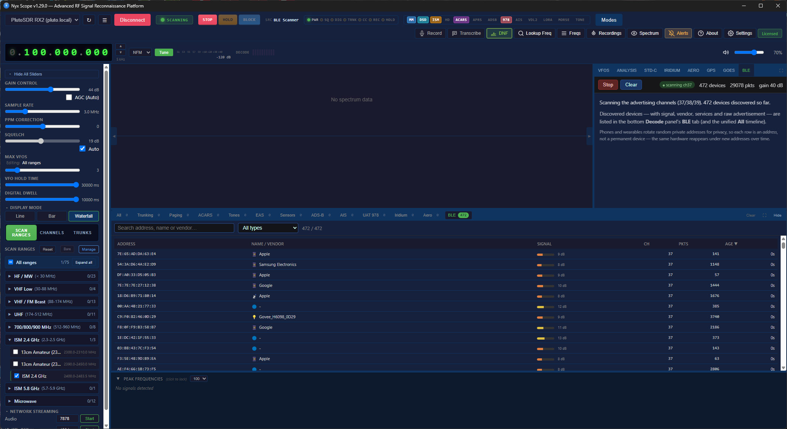
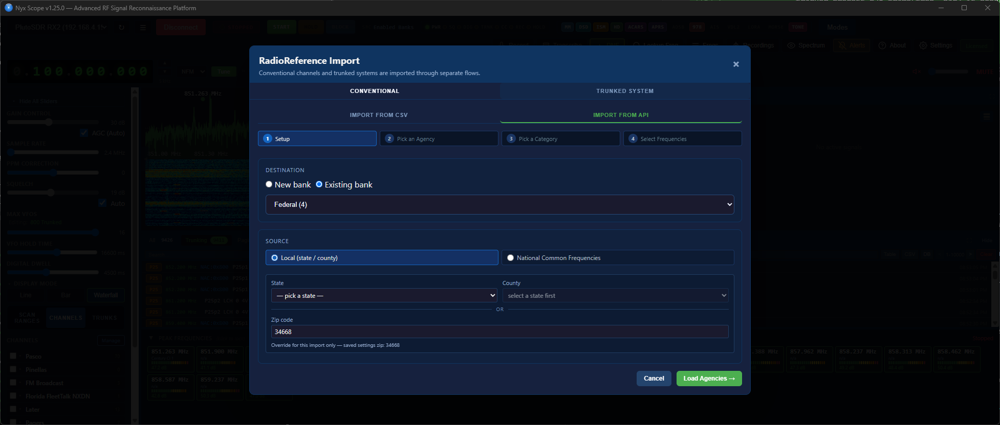
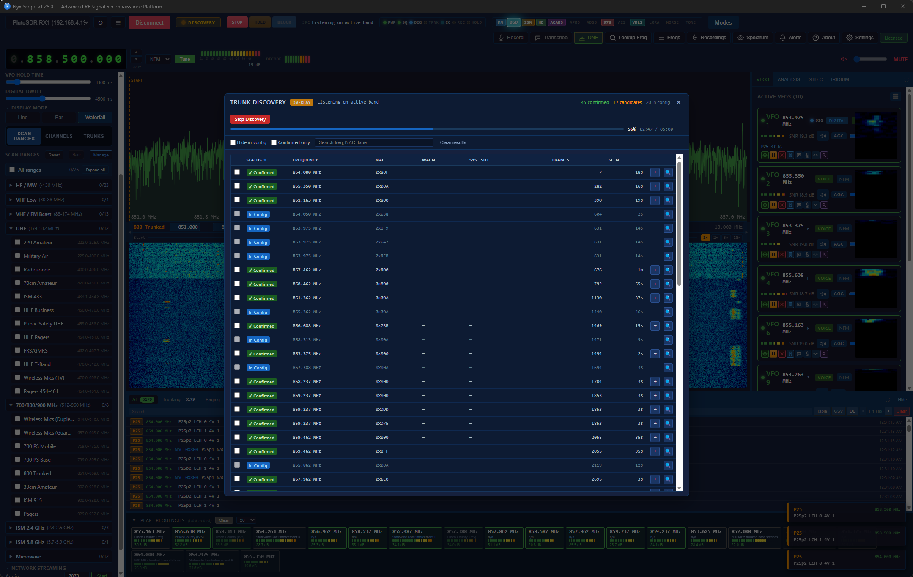
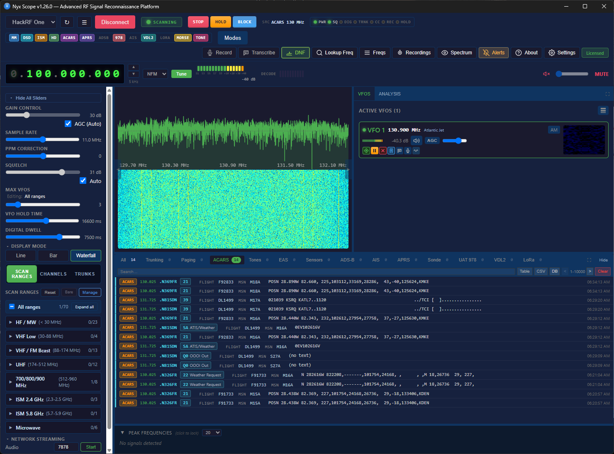
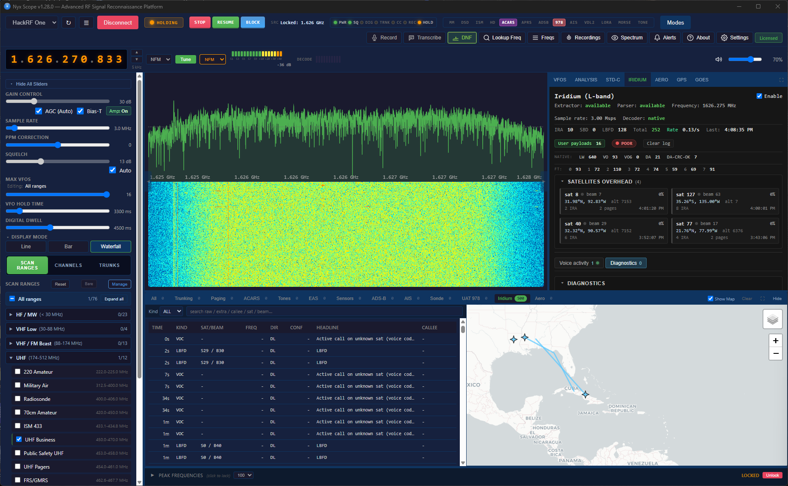
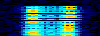
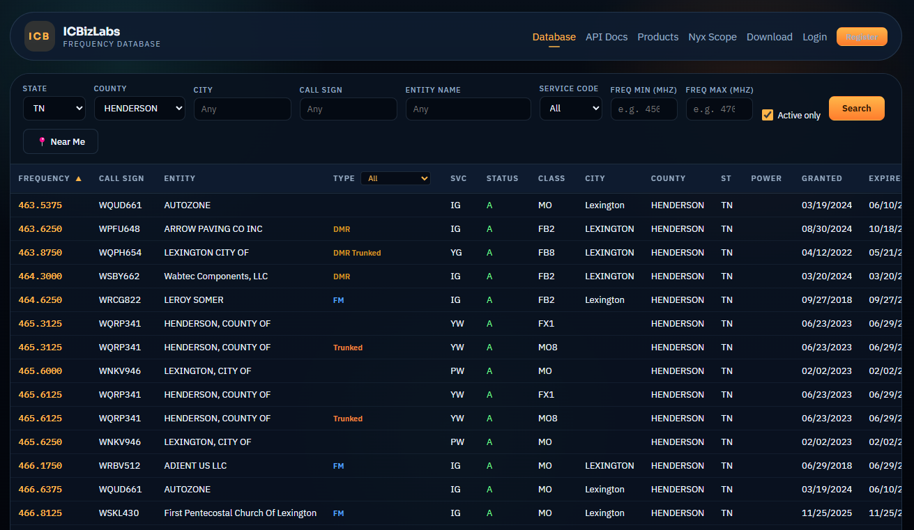

# NyxScope

**A multi-protocol SDR receiver for Windows. Native decoders for the protocols that matter, plus a curated toolkit for everything else.**

NyxScope is a Rust/Tauri application that decodes most of its digital protocols natively — P25 Phase 1 and Phase 2 voice, EDACS and NXDN control channels, ADS-B, AIS, ACARS, POCSAG, FLEX, LoRa CSS PHY + LoRaWAN MAC, Morse, RDS, CTCSS/DCS, signal classification — in-process, no sidecar. For protocols where a mature open-source decoder already exists, NyxScope bundles it (`multimon-ng`, `rtl_433`, `dsd-neo`, `nrsc5`, `direwolf`, `dumpvdl2`, `dump978`, `rs41mod`) so the app installs with zero `PATH` wrangling. You get spectrum and waterfall, multiple concurrent VFOs, trunked-radio following, digital voice, aviation and marine tracking, paging, ISM sensors, HD Radio, and transcription, in one binary.

[**Download**](https://github.com/ICBizLabs/NyxScope/releases/latest) · [**Website**](https://i-c.biz/) · [**User Manual**](./MANUAL.md) · [**Docs**](https://github.com/ICBizLabs/NyxScope/wiki) · [**Source mirrors**](https://i-c.biz/sources/) · [**Issues**](https://github.com/ICBizLabs/NyxScope/issues)

> **NyxScope is a public BETA — features are fluid.** It's stable enough for
> daily use, but this is active development: **features may be added, changed,
> or removed at any point**, and nothing is locked until a release candidate.
> Some decoders are still being hardened against weak signals. This is exactly
> the stage where your feedback shapes the product — please report what works
> and what doesn't (and whether a bug is in NyxScope or a bundled decoder), and
> tell us what you'd like added or dropped.

*Wideband scanning the 800 MHz band: the live spectrum and waterfall surface every active signal, peaks auto-tune idle VFOs, and each VFO card carries its own mini-waterfall, signal meter, tone/CTCSS readout, and independent audio.*

---

## What's new in 1.33.3 (BETA)

Full notes: [`RELEASE_NOTES_v1.33.3.md`](./RELEASE_NOTES_v1.33.3.md).

This update is about device support. If you own an **Airspy**, this is the one to try.

- **Airspy audio.** Audio was garbled on every mode for every Airspy user. It was a sample rate problem in the driver layer, not your radio or your setup. Fixed.
- **HackRF Pro.** The Pro was never detected because our HackRF library was older than the Pro itself. The library is updated and the Pro should now work.
- **PlutoSDR audio stutter.** The rhythmic breakups in voice audio are gone. The data path between the Pluto and the app was reworked.

Previous release (1.33.2): crash fixes for Airspy/HackRF disconnect, device scanning with foreign Soapy drivers, spectrum short-buffer, and transcription (non-English text + older CPUs without AVX2) — [`RELEASE_NOTES_v1.33.2.md`](./RELEASE_NOTES_v1.33.2.md).

---

## What NyxScope decodes natively

Most of NyxScope's digital decode work runs in native Rust inside the application — no sidecar, no IPC on the hot loop, no upstream tool to install or version-match:

- **P25 Phase 1 voice** with soft-NID and best-effort IMBE FEC — 94–96% frame recovery on weak signals where stock decoders get zero syncs. The IMBE codec itself runs in an isolated `sdr-imbe-helper` subprocess against `mbelib-neo`.
- **P25 Phase 2 TDMA voice** — π/4 DQPSK demod with Gardner timing recovery, 21-dibit TDMA sync, dual-slot extraction, AMBE+2 decode.
- **EDACS control channel** — 9600 baud GMSK, BCH(40,28), ESK auto-detect, Standard and EA mode (auto-detected from site-ID pattern), with voice following on the data channels.
- **NXDN48 control channel** — 4FSK demod, FSW sync, PN 9,5 scrambler, K=5 Viterbi FEC, CRC-16 / CRC-6 protected CAC and SACCH frames.
- **ADS-B (1090 MHz)** — native Mode S extended-squitter decode straight off the IQ stream.
- **AIS (162 MHz)** — native dual-channel GMSK decoder.
- **ACARS** — native MSK decoder with multi-channel VFO scheduling.
- **POCSAG 512 / 1200 / 2400** — in-process, no `multimon-ng` subprocess on paging-only ranges.
- **FLEX 1600 / 3200 / 6400** — in-process, same path.
- **LoRa CSS PHY** — chirp / dechirp / FFT decoder with parallel SF7–12 paths per channel, Hamming and CRC handling, and LoRaWAN MAC parsing (DevAddr, FCnt, FPort, MType) across nine regional plans.
- **Morse / CW** with on-card readout.
- **CTCSS / DCS** — Goertzel-based CTCSS (50 tones, median noise-floor gating) and Golay(23,12) DCS (83 codes, every alignment and polarity).
- **RDS** for WFM (station name, RadioText, PTY, TP/TA).
- **Bluetooth LE advertising scanner** — native GFSK decode on the three 2.4 GHz advertising channels (37/38/39), with channel-seeded whitening and CRC-24 validated against real packets. Rich advertisement parsing (flags, service UUIDs, TX power, appearance, manufacturer, iBeacon/Eddystone), a device table keyed by MAC with **IEEE OUI vendor lookup** (~40k orgs), device-type icons, a type filter, and a signal meter. A dedicated scan mode cycles the channels; a normal 2.4 GHz scan also surfaces BLE opportunistically. Needs a 2.4 GHz SDR (HackRF / PlutoSDR / Airspy).
- **Signal classification (AMC)** — labels FSK / GFSK / OOK / OFDM and friends from IQ alone.
- **Protocol identification** — IQ-fingerprint-based POCSAG/FLEX disambiguation, before any decoder is run.
- **Multi-stage IQ decimation pipeline** for NFM/AM — VFO does IQ→IQ→FM demod instead of IQ→FM→audio decim, recovering ~14 dB of pager-sideband sensitivity.
- **Integer CIC + FM demod pipeline** for digital voice — the path that makes DSD actually sync on real signals (matches `rtl_fm` round-trip exactly).
- **Native HD Radio host-side resampler** — bit-accurate cubic Hermite + Blackman LPF, lets the `nrsc5` sidecar run on whatever sample rate the SDR will give us.
- **Multi-SDR registry and tabbed UI (preview)** — the backend registry manages multiple SDRs in parallel with per-slot scan / VFO / message streams; the `SlotTabs` strip appears once a second SDR is connected. Single-SDR users see no UI change. Treated as preview until a Pro License SKU ships.
- **Adaptive auto-squelch** with one-shot calibration and continuous noise-floor tracking.
- **HTTP control surface** on port 8765 — JSON API for status, audio streaming, IQ streaming, debug stats, message tails, and headless operation. Always-on, separate from the Tauri GUI.

## Bundled decoders

For protocols where a mature open-source decoder already exists, NyxScope bundles it as a sidecar so the app installs with zero `PATH` configuration. Each sidecar runs as a separate process — not statically linked into the main binary — so license obligations stay scoped to each component. To keep the base installer lean, the heavier and satellite-focused sidecars download on demand (SHA-256 verified) from the in-app **Feature Manager** the first time you need them.

| Tool | What NyxScope uses it for | License |
| --- | --- | --- |
| [dsd-neo](https://github.com/arancormonk/dsd-neo) | DMR, D-STAR, YSF, M17, and NXDN voice (P25 voice and EDACS/NXDN control are native) | GPL-3.0-or-later |
| [mbelib-neo](https://github.com/arancormonk/mbelib-neo) | IMBE / AMBE+2 vocoder, called from the native P25 paths via an isolated helper | GPL-2.0-or-later |
| [rtl_433](https://github.com/merbanan/rtl_433) | 200+ ISM-band sensors and utility meters | GPL-2.0-or-later |
| [multimon-ng](https://github.com/EliasOenal/multimon-ng) | DTMF / ZVEI / EEA / EIA / CCIR tones, EAS/SAME, AFSK, classic packet modes (POCSAG and FLEX are native) | GPL-2.0-or-later |
| [nrsc5](https://github.com/theori-io/nrsc5) | HD Radio (NRSC-5) audio and metadata | GPL-3.0 |
| [direwolf](https://github.com/wb2osz/direwolf) | APRS / AX.25 packet | GPL-2.0 |
| [dumpvdl2](https://github.com/szpajder/dumpvdl2) | VHF Data Link Mode 2 | GPL-3.0 |
| [dump978](https://github.com/mutability/dump978) | UAT 978 MHz ADS-B | GPL-2.0 |
| [rs41mod (RS)](https://github.com/rs1729/RS) | Radiosonde telemetry (RS41, RS92, DFM, M10/M20) | GPL-3.0 |

App frameworks: [Rust](https://www.rust-lang.org), [Tauri](https://tauri.app), and [Svelte](https://svelte.dev) — Apache-2.0 / MIT.

If a decode is wrong inside one of the bundled tools, the fix usually belongs **upstream** with the project that owns that decoder. Bugs in NyxScope's UI, native decoders, scanner engine, or sidecar wiring belong here. We do not maintain forks of bundled tools.

## License and source code

- **The NyxScope application is proprietary.** It is governed by [`eula.md`](./eula.md), not an OSI-approved open-source license.
- **Bundled decoders remain under their upstream licenses** (see [`THIRD_PARTY_NOTICES.md`](./THIRD_PARTY_NOTICES.md) and the [`LICENSES/`](./LICENSES/) directory). Each runs as a separate sidecar process — not statically linked into the main binary — so license obligations stay scoped to each component.
- **GPL containment.** The IMBE / AMBE / AMBE+2 vocoder (`mbelib-neo`) runs in a dedicated `sdr-imbe-helper` subprocess that talks to the main app over stdin/stdout. That helper is GPL-2.0-or-later; the main binary contains no GPL object code and stays governed solely by the EULA.
- **Per GPL §3(a), exact corresponding source for every bundled GPL- and LGPL-licensed component is published per release at:**
  - https://i-c.biz/sources/v{version}/
  - Each release directory contains the exact source matching the binaries in that installer, indexed by NyxScope version. A written request on physical media is also available — see EULA §9.3.
- **Network behaviour is documented.** The full privacy policy lives in [`privacy.md`](./privacy.md). In short: no listening data ever leaves the machine; outbound traffic is limited to a periodic license heartbeat (key id + hashed hardware fingerprint, no audio/IQ/messages), opt-in crash reports, and the on-click lookups described below.

## What it does

- **Live spectrum and GPU waterfall** with peak picking, hover tooltips, right-click tune-to, and one-click skip from peaks. The waterfall renders in WebGL — smooth and interpolated, with the history scrolled and colour-mapped on the graphics card (it falls back to a CPU renderer when WebGL isn't available).
- **IQ-recording playback** — load a saved capture (`.cf32` / `.cs16` / `.cu8` / `.fc32` / `.sc16` / `.raw`) as a playback "device" and run every native decoder, VFO, and protocol panel against it as if it were live.
- **Multiple concurrent VFOs** with mini-waterfalls (centered on the channel and scaled to its bandwidth) and independent audio per channel.
- **Adaptive auto-squelch** that tracks the noise floor with one-shot and continuous modes.
- **Auto-identify digital protocol** — point at an unknown digital signal and the app cycles through DSD modes and picks the best match.
- **Signal classification** that labels the modulation (FSK, GFSK, OOK, OFDM, …) from IQ.
- **Bluetooth LE scanner** — discover nearby BLE advertisers (phones, watches, earbuds, beacons, sensors, trackers) on 2.4 GHz, with vendor names, device-type icons, signal strength, and full advertisement detail.
- **Quick Modes** — one-click presets for ADS-B, AIS, ACARS, VDL2, APRS, pagers, ISM sensors, and radiosondes.
- **Channel-bank scanning** with priority, skip lists, and import from CHIRP / RadioReference / FCC.
- **Live tracking map** for ADS-B, AIS, APRS, and radiosondes, side-by-side with the data table — never a blocking modal.
- **HTTP audio streaming** so any channel can be listened to from another device on the LAN.
- **IQ streaming** in an `rtl_tcp`-compatible format for chaining into external tools.
- **Per-VFO recording** — WAV and IQ, with VAD/VOX triggers, pre/post-record buffers, and notes that travel with the file.
- **Per-band scanner overrides** — squelch, hold time, dwell, and digital-detect settings remembered per band.

*The BLE tab lists every advertising device deduped by MAC — address, name and vendor (from the manufacturer ID or the IEEE OUI registry), a category icon, a signal bar, the advertising channel and packet count — with sortable/searchable columns and full per-device advertisement detail (services, iBeacon/Eddystone, raw hex).*

*Channel banks can be populated by importing directly from RadioReference (and CHIRP / FCC), pulling in a system's frequencies and talkgroups so you're scanning in seconds.*

## Protocol coverage

### Trunked radio

*Following a P25 system: NyxScope decodes the control channel, shows the active call's talkgroup and source, and tunes the granted voice frequency automatically — with a Phase 1 / Phase 2 badge so you can see which voice mode is in use.*

- **P25 Phase 1** — native IMBE voice with best-effort FEC, 94–96% frame recovery on signals where stock tools get nothing.
- **P25 Phase 2 TDMA** — native AMBE+2 voice with automatic Phase 1 / Phase 2 routing from the control channel.
- **EDACS** — Standard, EA, and Networked sites with optional ProVoice digital voice.
- **NXDN** — NXDN48 and NXDN96 with channel-map editing.
- **Control-channel auto-discovery** across 851–869 MHz, identifying systems by NAC, WACN, RFSS, and Site.
- **Active call tracking** — talkgroup, source ID, encryption flag, and call history.

*Trunk Discovery watches a band and surfaces the control-channel candidates it finds, so you can identify and add a trunked system without knowing its frequencies up front.*

### Digital voice

P25 (Phase 1 & 2), DMR, NXDN48, NXDN96, D-STAR, Yaesu System Fusion, M17, ProVoice — manual mode selection on a locked frequency, or hit **Identify** and let the app pick.

### Aviation and marine

*ADS-B 1090: aircraft plotted on a live map next to the data table — ICAO hex, callsign, altitude, speed and heading — with optional one-click metadata lookup for registration, type and operator.*

- **ADS-B 1090** — live aircraft positions, ICAO codes, altitude, callsigns, on a map.
- **UAT 978** — general aviation ADS-B (`dump978`).
- **AIS 162** — vessel MMSI, position, speed, heading (native dual-channel GMSK decoder).
- **ACARS 130** — flight messages, registrations, labels (built-in decoder).
- **VDL2 137** — VHF Data Link Mode 2 (`dumpvdl2`).

*ACARS: NyxScope schedules VFOs across the standard VHF ACARS channels and decodes messages natively — registration, flight ID, the 2-character label with its description, and the message body.*

### Satellite & L-band

A suite of space and L-band receivers (downloaded on demand from the Feature Manager). Most need an **L-band antenna / LNA** and a clear sky view, and several are still being hardened against weak signals — see the BETA note.

*Iridium (1.6 GHz): NyxScope's native burst decoder classifies and parses Iridium frames (Ring Alert / IRA satellite overhead, broadcast, data) into a live, filterable timeline, with a quick-start preset and map view.*

- **Iridium (1.6 GHz)** — built-in native burst decoder (IRA / IBC / IDA and more) with a voice-activity tab, a Ring-Alert preset, and a satellite map view. No external tools or Python needed.
- **Aero ACARS (Inmarsat L-band, ~1.5 GHz)** — aircraft↔ground satellite messaging via the Inmarsat sniffer, with per-satellite selection (4F3 / 3F5 / AF1 / F1) and an antenna-peaking C/N meter.
- **STD-C (Inmarsat-C, ~1.541 GHz)** — maritime safety + EGC bulletins, with live lock-health diagnostics and offline IQ-file decode.
- **GOES LRIT (1.69 GHz)** — geostationary weather-satellite imagery via a SatDump sidecar over an in-process `rtl_tcp` bridge, with an az/el pointing helper from your location.
- **GPS L1** — native acquisition (visible PRNs with SNR and Doppler) for antenna/sky-view validation.

### Paging and sensors

*FLEX paging: NyxScope's native FLEX/POCSAG decoders surface messages with capcodes, timestamps and content. A dedicated wideband pager-monitor mode can watch many paging channels at once across the band.*

- **POCSAG 512 / 1200 / 2400** with capcode filtering and force-alpha override.
- **FLEX and FLEX NEXT** with capcode tracking.
- **rtl_433** — 200+ ISM device types: smart meters (ERT, IDM, NETIDM), weather stations (Bresser, Acurite, LaCrosse, Ambient), tire pressure monitors, garage doors, doorbells, soil moisture, and many more.
- **Radiosondes** — RS41, RS92, DFM, M10/M20 on 400–406 MHz.
- **LoRa** — native CSS PHY decoder with multi-region channel plans (US915, EU868, EU433, AU915, AS923, CN470, IN865, KR920, RU864) and LoRaWAN MAC parsing.

*ISM sensors via `rtl_433`: weather stations, smart meters, tire-pressure monitors, remotes and 200+ more device types decoded into a live table with model, ID and readings.*

### Tones, signaling, emergency

- DTMF, ZVEI 1/2/3, DZVEI, PZVEI, EEA, EIA, CCIR.
- CTCSS — 50 standard tones, detected per VFO.
- DCS — 83 standard codes, detected per VFO.
- EAS / SAME emergency alerts.
- CallerID (CLIP) and German FMS (fire/ambulance).
- Native Morse / CW decoder with on-card readout.

### Broadcast

*HD Radio (NRSC-5): lock an FM broadcast and NyxScope decodes the digital sidebands — switch between HD1–HD4 subprograms and read station name, slogan, and live title / artist / album.*

- **HD Radio (NRSC-5)** — locks onto FM broadcast, switches between HD1–HD4 programs, shows station name, slogan, title, artist, album, genre, and quality stats.
- **RDS** — station name, RadioText, program type, traffic alerts on any WFM lock.

### Amateur

- **APRS** packet positions, weather, telemetry, messages.
- AFSK1200 / AFSK2400 / FSK9600 packet data.
- D-STAR, YSF, and M17 digital voice.

## Quick Modes

*Quick Modes: one click sets the frequency, sample rate, decoder and view for a common task — no manual tuning.*

| Preset | Frequency | What you get |
| --- | --- | --- |
| ADS-B 1090 | 1090 MHz | Aircraft on a live map |
| AIS 162 | 161.975 / 162.025 MHz | Vessels on a live map |
| ACARS 130 | 129–131 MHz | Aircraft messages and flight data |
| VDL2 137 | 136.975 MHz | Modern VHF Data Link aircraft messaging |
| APRS 144.390 | 144.390 MHz | Amateur packet positions and weather |
| Pagers 929–932 | 929–932 MHz | POCSAG and FLEX pager traffic |
| 433 Sensors | 433 MHz ISM | European wireless sensors |
| 915 Sensors | 902–928 MHz | US smart meters, weather, security |
| Radiosonde 400–406 | 400–406 MHz | Weather balloon telemetry |

## Hardware support

Bring your own SDR. The popular ones work natively:

| Hardware | Frequency Range |
| --- | --- |
| RTL-SDR (and clones) | 24 MHz – 1.766 GHz |
| HackRF One | 1 MHz – 6 GHz |
| Airspy R2 / Mini | 24 MHz – 1.8 GHz |
| SDRplay (RSP series) | 1 kHz – 2 GHz |
| LimeSDR / LimeSDR Mini | 100 kHz – 3.8 GHz |
| PlutoSDR / Pluto+ | 70 MHz – 6 GHz (USB or Ethernet) |
| Network SDRs | `rtl_tcp` servers, auto-discovered on the LAN |

RTL-SDR devices need WinUSB / libusb drivers — install via [Zadig](https://zadig.akeo.ie/). HackRF, Airspy, bladeRF, SDRplay, Fobos, and PlutoSDR work via SoapySDR; install the matching Soapy module and vendor driver.

## Editions

NyxScope is **fully functional for free** — every decoder works (ADS-B, UAT, AIS, ACARS, P25/DMR/NXDN/EDACS voice, VDL2, HD Radio, APRS, radiosonde, LoRa, ISM sensors, POCSAG/FLEX paging, CTCSS/DCS, RDS, signal classification), along with trunked-radio following, audio and IQ recording, and Whisper transcription. The free tier runs up to **3 concurrent VFOs** and applies modest quotas to saved recordings, transcriptions, and pager messages.

A **license** lifts those limits and adds the infrastructure features: **unlimited VFOs**, HTTP and RTL-TCP audio streaming, unlimited recording and transcription, and built-in access to the **i-c.biz FCC frequency-lookup database** (no separate API key). A trial of the licensed features starts automatically on first install — no card required. Licenses are bound to a hardware fingerprint and transferable on request. See the License dialog in-app for activation details.

The license model is described in detail in [`eula.md`](./eula.md).

## Privacy and data

- **Audio, IQ, recordings, transcripts, and the spectrum waterfall stay on your machine.** None of it is ever transmitted.
- **Local Whisper** transcription is fully offline — audio never leaves the machine.
- **Cloud transcription** (OpenAI Whisper API) is opt-in **per channel**. The app never sends audio without an explicit Enable click. The endpoint URL is user-configurable; the OpenAI default ships disabled until you paste in your own API key.
- **License heartbeat** — Trial and Licensed installs check the license server every few hours to confirm the key hasn't been revoked. The ping carries your numeric key id and a hashed hardware fingerprint. No listening data is included.
- **Crash reports** are opt-in. After a panic, the next launch shows the full report inline and nothing is sent unless you click **Send**. Reports are double-redacted (license keys, tokens, IPs, and home paths replaced) before transmission.
- **FCC database and aircraft lookups** only happen when you click **Lookup** or **Auto-enrich** — see the section below.

Full plain-language details and opt-out steps live in [`privacy.md`](./privacy.md), shipped inside every release artifact. Online version: [i-c.biz/policies/privacy.php](https://i-c.biz/policies/privacy.php).

## Online lookups (optional)

NyxScope can enrich what it shows you with two optional online lookups. Both are gated to Trial / Licensed tiers and both can be turned off in Settings. Free-tier users can perform the same lookups manually at [i-c.biz/db](https://i-c.biz/db) at no charge.

*The same FCC ULS and aircraft data NyxScope uses for in-app enrichment is browsable for free at [i-c.biz/db](https://i-c.biz/db) — search by frequency to find the licensee, callsign, service and expiry, or by ICAO hex for aircraft registration and operator.*

- **FCC ULS frequency lookup** — when you right-click a frequency in any data tab, NyxScope can query [i-c.biz/db](https://i-c.biz/db), a self-hosted mirror of the FCC's Universal Licensing System, to identify the licensee, callsign, service code, and license expiry. Data source: the FCC ULS public bulk database (US Federal Government, public domain). Endpoint: `https://i-c.biz/db/api/v2/search/frequencies`.
- **Aircraft metadata lookup** — when an ADS-B (1090) or UAT (978) target appears with an ICAO hex code, NyxScope can resolve the registration, type, and operator via a self-hosted mirror of the OpenSky aircraft database. Endpoint: `https://i-c.biz/db/api/v2/aircraft`. The OpenSky aircraft database is community-maintained and free to redistribute under its own terms.

Both endpoints accept only the lookup key (frequency range or ICAO hex). No audio, no IQ, no positional or talkgroup data is sent. The endpoint URL is overridable in Settings — point it at your own mirror or disable lookups entirely.

## Install

**Windows 10 or 11 (64-bit).** Download the latest `.exe` installer from [Releases](https://github.com/ICBizLabs/NyxScope/releases/latest) and run it. The installer bundles every decoder sidecar plus the runtime DLLs they need.

NyxScope is currently Windows-only. 

## System requirements

- 64-bit Windows 10 or 11
- 4 GB RAM minimum; 8 GB recommended for heavy multi-VFO use with transcription
- Compatible SDR hardware (see table above)
- ~500 MB disk for the app, plus room for recordings

## A note from the developer

The last couple of releases were messy — sorry about that. I'll try to do
better. With all the feedback we're now receiving, the bugs should get squashed
fairly quickly.

And please don't rush to purchase. Make sure NyxScope is a good fit for you, and
that you won't mind dealing with beta releases that may occasionally break
things. I'm only one person, so without testers there's no way I can find every
bug — as I'm now seeing. Thanks for your help.

## Community and support

- **Discord** — join the NyxScope community at [discord.gg/Wf4RRc2VPp](https://discord.gg/Wf4RRc2VPp) for help, signal hunting, and feature talk.
- **Bug reports & feature requests** — [open an issue](https://github.com/ICBizLabs/NyxScope/issues). Please note whether the bug is in NyxScope itself or in a bundled decoder; protocol-layer issues are usually best filed upstream as well.
- **User Manual** — task-oriented walkthrough of the app: scanning, trunking, aircraft, paging, HD Radio, recording, and so on. See [`MANUAL.md`](./MANUAL.md).
- **Documentation and guides** — the [project wiki](https://github.com/ICBizLabs/NyxScope/wiki): FAQ, hardware & trunking setup, HD Radio, and the HTTP API.
- **Website** — [i-c.biz](https://i-c.biz/) for downloads, licensing, and the frequency database.

## Acknowledgments

NyxScope ships its own decoders for most digital protocols and integrates a curated set of established open-source tools for the rest. Thanks to the maintainers of `dsd-neo`, `mbelib-neo`, `rtl_433`, `multimon-ng`, `nrsc5`, `direwolf`, `dumpvdl2`, `dump978`, and `rs41mod`, and to the Rust, Tauri, and Svelte projects — the bundled-tools side of NyxScope rests on their work. The full list of upstream libraries lives in [`THIRD_PARTY_NOTICES.md`](./THIRD_PARTY_NOTICES.md).

If you find NyxScope useful, please also consider supporting the upstream projects.

---

*Distributed by ICBizLabs · [i-c.biz](https://i-c.biz/) · [Docs](https://github.com/ICBizLabs/NyxScope/wiki) · [Discord](https://discord.gg/Wf4RRc2VPp)*
